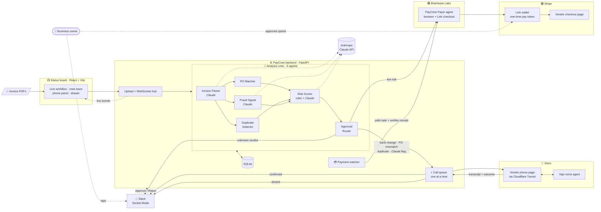
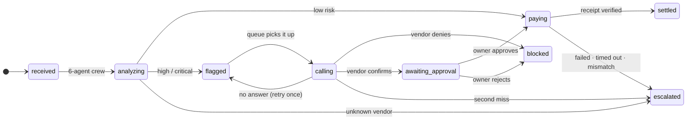

<div align="center">

# 🛡️ PayCrew

### The finance department a small business can't afford to hire.

**Invoices land. A crew of AI agents reads them in seconds. Clean ones get paid. Suspicious ones trigger a phone call to the vendor, before a single dollar moves.**


*Built at Startup Speedrun, Cloudflare HQ · Tracks: Agentic Payments + Autonomous Organizations*

</div>

---

## The problem

A fraudster poses as one of your vendors. The invoice looks real: same logo, same amount, same line items. Only one thing changed, **the bank account**. One wire later, the money is gone.

Business email compromise is among the costliest cybercrimes for US businesses.¹ Large companies stop it with a finance team that **calls the vendor back** on a known number before paying. Small businesses don't have that team. The owner is the AP clerk, the approver and the fraud desk, so the callback never happens.

## What PayCrew does

| | |
|---|---|
| 🧠 **Reads** | A six-agent crew parses every PDF with Claude, checks it against purchase orders and payment history, and hunts for impersonation signals. |
| ⚖️ **Decides** | Deterministic rules, not a model, decide what happens to money. Claude can raise caution, never lower it. |
| 💳 **Pays** | Clean invoices go to a **Brainbase payer agent** that checks out with a **Stripe Link** wallet, after the owner approves the spend in Link. |
| 📞 **Calls** | Suspicious invoices trigger a **voice agent** that calls the vendor on the number *already on file*, never the one on the invoice. |
| 💬 **Asks** | Vendor-confirmed changes go to the owner in **Slack** with Approve / Reject buttons. Fraud and escalations get alerts. |
| 📺 **Shows** | A live board: animated agent workflow, per-invoice crew trace, live call transcript, payments and fraud blocked. |

---

## Architecture



### Invoice lifecycle



---

## The analysis crew

Modeled on our earlier six-agent AP crew ([Agentforge](https://github.com/2006-sk/Agentforge)), rebuilt around Claude.

| # | Agent | Engine | What it does |
|---|---|---|---|
| 1 | **Invoice Parser** | Claude Opus 5 | Reads the PDF: vendor, invoice #, total, due date, PO, last 4 of the bank account. Text fallback if Claude is unavailable. |
| 2 | **PO Matcher** | rules | Is the PO ours, this vendor's, and for this amount? |
| 3 | **Duplicate Detector** | rules | Same vendor + invoice number seen before? |
| 4 | **Fraud Signal** | Claude Opus 5 | Reviews the invoice against *our* vendor file: changed bank details, urgency, "don't call us", gift cards, look-alike names. |
| 5 | **Risk Scorer** | rules + Claude | Rules set LOW / HIGH / CRITICAL. Claude writes the plain-English explanation for the owner. |
| 6 | **Approval Router** | rules | Low → pay. High / critical → call the vendor. Unknown vendor → a human. |

Agents 2–4 run in parallel. Every step streams live to the board with its engine, timing and finding.

---

## Money safety

PayCrew moves real money, so the design assumes every AI component can be wrong.

- **Rules decide money.** Claude findings are advisory. Claude may escalate a clean-looking invoice to a phone check; it can never lower a risk level.
- **Calls use the number on file.** The voice agent never dials a number from the invoice.
- **A confirmation never pays by itself.** Vendor-confirmed changes still need the owner's Approve in Slack or on the board. Only a denial acts automatically (it blocks).
- **Trusted checkout only.** The payer may pay only at a checkout link from PayCrew's own vendor config, never one from an invoice, for the exact amount, at most once.
- **Receipts are verified.** An invoice is marked paid only when the payer's report matches the reserved payment exactly: reference, amount, currency, merchant, order id. Anything ambiguous becomes `unknown` and is never retried automatically.
- **Idempotent and capped.** Payments are reserved in the database with an idempotency key *before* dispatch. A per-invoice spend cap blocks anything larger.
- **Fails closed.** Payments ship switched off. Missing configuration means no payment, with a clear reason on the board.

> **Demo mode.** For the hackathon, each payment is a **real $1 Link charge** standing in for the invoice total (`BRAINBASE_DEMO_CHARGE_CENTS`), and the board can show a paying invoice as paid after 15 seconds (`BRAINBASE_DEMO_SETTLE_SECONDS`). Both are labeled in the invoice drawer.

---

## Tech stack

| Layer | Tools |
|---|---|
| Board | React 19, Vite, Framer Motion, canvas-confetti, live WebSocket |
| Backend | FastAPI, SQLite, asyncio call queue + payment watcher |
| AI | Anthropic Claude Opus 5 (PDF input, structured outputs) |
| Payments | Brainbase agent + Stripe Link agent checkout, via the Brainbase task API |
| Voice | Vapi voice agent · browser vendor phone · Cloudflare Tunnel |
| Messaging | Slack Block Kit + Socket Mode (no public URL needed) |

## Repository layout

```
backend/
  main.py              FastAPI app, WebSocket hub, approve/reject, webhooks
  pipeline.py          upload → crew → rules → pay or call
  agents/crew.py       the six-agent analysis crew
  agents/analysis_agent.py   Claude PDF extraction (+ text fallback)
  agents/call_judge.py       Claude decides a call's outcome from its transcript
  rules.py             deterministic risk rules
  call_queue.py        one call at a time, retries, restart recovery
  calling/             vendor phone page, Vapi assistant, provider webhooks
  brainbase_payer.py   Brainbase payer dispatch, receipt verification, watcher
  slack_notify.py      Slack messages · slack_socket.py  buttons via Socket Mode
  demo_invoices/       5 demo invoices + extra/ (11 good and odd ones)
  test_*.py            97 offline tests
frontend/              status board, agent workflow, simulated demo
brainbase-agents/payer/    PayCrew Payer agent (Brainbase manifest + instructions)
agent/                 invoice analyst agent (Brainbase)
docs/                  payment integration handoff
```

---

## Run it

**Backend**

```bash
cd backend
python -m venv .venv && .venv/bin/pip install -r requirements.txt
cp .env.example .env          # fill in the keys you have; everything else fails closed
cd .. && backend/.venv/bin/python -m uvicorn backend.main:app --port 8000
```

**Board**

```bash
cd frontend && npm install
VITE_API_BASE=http://localhost:8000 VITE_WS_URL=ws://localhost:8000/ws npm run dev
```

With no `VITE_API_BASE`, the board runs on mock data. Click **🎬 Simulated demo** for the narrated three-minute walkthrough.

**Real vendor calls**

```bash
cloudflared tunnel --url http://127.0.0.1:8000   # set PUBLIC_BASE_URL to the printed URL
```

The vendor opens `<PUBLIC_BASE_URL>/phone/<number on file>` on their phone, goes online, and answers when it rings. The live transcript appears on the board.

### Key settings (`backend/.env`)

| Setting | Purpose |
|---|---|
| `ANTHROPIC_API_KEY` | Claude for the crew and call judging |
| `MOCK_CALLS` / `CALL_PROVIDER` | `true` for scripted calls; otherwise `web`, `vapi` or `brainbase` |
| `VAPI_PUBLIC_KEY`, `PUBLIC_BASE_URL` | browser voice calls through the tunnel |
| `SLACK_BOT_TOKEN`, `SLACK_APP_TOKEN`, `SLACK_CHANNEL_ID` | alerts + Approve / Reject buttons |
| `BRAINBASE_PAYMENTS_ENABLED`, `BRAINBASE_TOKEN`, `BRAINBASE_PAYER_AGENT_ID` | payments via the Brainbase payer agent |
| `BRAINBASE_PAY_MAX_CENTS`, `VENDOR_PAYMENT_URLS` | spend cap and trusted checkout links |

---

## Demo invoices

`backend/demo_invoices/` holds the five invoices from the pitch; `extra/` adds eleven more from the same companies:

| | Invoice | What PayCrew does |
|---|---|---|
| ✅ | 5 normal invoices, one per vendor | Low risk → paid |
| 🔁 | INV-441 sent again | Duplicate → phone check |
| 📈 | INV-446, $7,490 against an $800 PO | PO mismatch → phone check |
| 🏦 | INV-447, new bank + "don't call us" + 24h deadline | Critical → phone check |
| 🧾 | INV-403 using another vendor's PO | Foreign PO → phone check |
| 🎁 | INV-913 asking for gift cards (bank matches!) | Claude flags it → phone check |
| 👯 | "Office Supply Co." look-alike | Unknown vendor → human review |

## Tests

```bash
backend/.venv/bin/python -m backend.run_offline_tests
```

97 tests run offline with temporary databases, faked providers and outbound network blocked. They cover payments, receipt verification, the crew, rules, calls, crash recovery and Slack buttons.

---

## Why it matters

Every small business pays invoices, and every one of them is a target. PayCrew turns the callback that large finance teams do by habit into something that happens automatically, on every suspicious invoice, in under a minute. It prices per invoice, and one stopped fraud pays for years of it. It fits into the phone and Slack a small business already uses.

## Team

| | Built |
|---|---|
| **Shresth** | Status board, Claude analysis crew, Brainbase payer, integration |
| **Zubair** | Backend spine: API, database, rules, call queue, payment safety |
| **Kenil** | Vendor verification calls: Vapi voice agent, vendor phone, call webhooks |

**Thanks to** [Brainbase Labs](https://brainbaselabs.com) for agents that can act and pay, [Stripe](https://stripe.com) for Link agent checkout, Anthropic for Claude, and Cloudflare for the tunnel and the venue.

<sub>¹ Our pitch cites $3.046B in reported 2025 US losses from business email compromise; confirm against the FBI IC3 annual report before quoting.</sub>
